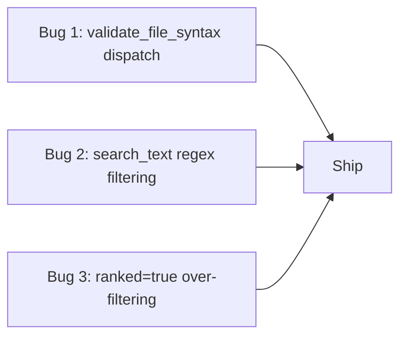
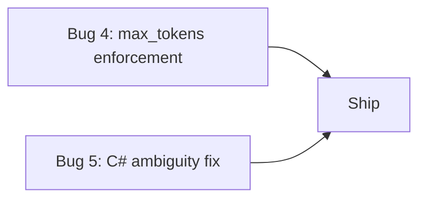
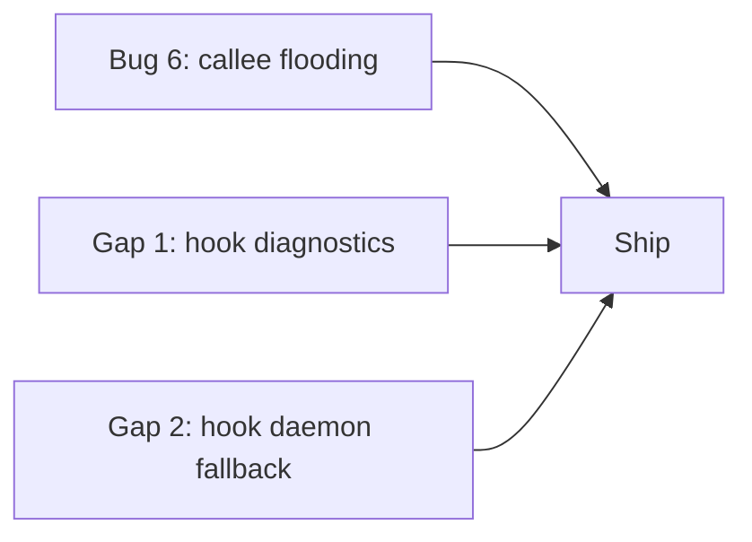

# Reviewer Bugs & RTK Adoption Gaps — Consolidated Fix Plan

**Date:** 2026-03-20
**Version:** SymForge 1.6.0
**Scope:** 6 reviewer-reported bugs + 3 RTK adoption gaps

---

## Summary

An AI reviewer tested SymForge 1.6.0 and uncovered 6 real issues ranging from a completely broken tool to subtle ranking/budget enforcement gaps. Additionally, RTK-style adoption testing revealed 3 gaps in hook bootstrapping and lifecycle. This plan consolidates all 9 items into 4 implementation batches.

---

## Bug 1: validate_file_syntax is broken (CRITICAL)

**Severity:** P0 — tool is registered in schema but returns "unknown tool" at runtime

### Root Cause (Confirmed)

The tool handler [`fn validate_file_syntax`](src/protocol/tools.rs:2602) exists with a full implementation, and the formatter [`fn validate_file_syntax_result`](src/protocol/format.rs:1276) is complete. However:

1. **Missing from daemon dispatch:** The match arm in [`fn execute_tool_call`](src/daemon.rs:1436) (ending at line ~1643 with the `other => anyhow::bail!` catch-all) has no `"validate_file_syntax"` case.
2. **Missing from sidecar handlers:** [`src/sidecar/handlers.rs`](src/sidecar/handlers.rs) has zero references to `validate_file_syntax`.
3. **Missing from protocol routing:** [`src/protocol/mod.rs`](src/protocol/mod.rs) also has no routing for this tool.

The tool schema definition makes it visible in `tools/list`, but when actually called, it hits the catch-all and fails with "unknown tool".

### Files to Modify

| File | Change |
|------|--------|
| [`src/daemon.rs`](src/daemon.rs:1436) | Add `"validate_file_syntax"` match arm in `execute_tool_call` |
| [`src/sidecar/handlers.rs`](src/sidecar/handlers.rs) | Add handler function and route |
| [`src/sidecar/router.rs`](src/sidecar/router.rs) | Add route if sidecar routing is used for this tool |

### Fix Approach

Add a dispatch arm following the same pattern as existing tools (e.g., `"search_text"`):

```
"validate_file_syntax" => Ok(server
    .validate_file_syntax(Parameters(decode_params::<ValidateFileSyntaxInput>(params)?))
    .await),
```

For the sidecar handler, add a corresponding endpoint that delegates to the same `validate_file_syntax` method.

### Testing Strategy

- Manual: Call `validate_file_syntax` with a valid `.toml` file and an intentionally malformed `.json` file
- Automated: Add a test case to the integration suite that calls the tool and asserts it returns diagnostics rather than "unknown tool"
- Regression: Verify all other tools still dispatch correctly

### Risk Assessment

**Low.** This is a simple wiring fix — the handler logic already exists and is tested at the format level. The only risk is a typo in the match arm string.

---

## Bug 2: search_text regex misses files that grep finds (CRITICAL)

**Severity:** P0 — search results diverge from grep, destroying trust

### Root Cause Hypothesis

Reviewing [`fn search_text_with_options`](src/live_index/search.rs:833), the regex path does NOT use trigram pre-filtering — it correctly iterates `index.all_files()`. However, the filtering chain in [`fn file_matches_text_options`](src/live_index/search.rs:976) applies multiple filters:

1. `options.path_scope.matches(path)` — path prefix filtering
2. `glob_filters.matches(path)` — include/exclude glob filtering
3. `options.search_scope.allows(&file.classification)` — code/text/binary scope
4. `options.noise_policy.allows(&file.classification)` — generated/test/vendor noise filtering
5. `options.language_filter` — language-specific filtering

The most likely culprits:

- **Noise policy defaults**: By default (`include_tests=false`, `include_generated=false`, `include_vendor=false`), files in test directories, vendor paths, or gitignored paths are excluded. The `NoisePolicy::classify_path` function at line 343 has aggressive heuristics — e.g., any file under `dist/`, `generated/`, or matched by `.gitignore` gets classified as noise.
- **Language filter mismatch**: If the C# language identifier does not exactly match what the file is classified as, the language filter could silently exclude files.
- **`search_scope` default**: The default `SearchScope` is `All`, so this should not be an issue unless a non-default scope was passed.

**Alternative hypothesis:** The reporter may have been using a glob or path_prefix that inadvertently excluded the files grep found.

### Files to Investigate

| File | Area |
|------|------|
| [`src/live_index/search.rs`](src/live_index/search.rs:976) | `file_matches_text_options` — the filter chain |
| [`src/live_index/search.rs`](src/live_index/search.rs:310) | `NoisePolicy::classify_path` — aggressive noise classification |
| [`src/protocol/tools.rs`](src/protocol/tools.rs:2031) | `search_text` handler — how input params are mapped to options |
| [`src/live_index/search.rs`](src/live_index/search.rs:833) | Regex path candidate generation |

### Proposed Fix

1. **Add diagnostic output:** When regex search returns 0 results, include a diagnostic footer showing how many files were scanned, how many were filtered by each filter stage, and what the effective noise policy was.
2. **Relax noise policy for explicit regex searches:** When `regex=true`, default to `NoisePolicy::permissive()` unless the user explicitly set `include_tests=false` etc. Rationale: regex searches are intentional and targeted — the user knows what they want.
3. **Alternative:** Add a `debug=true` parameter that returns filter-stage counts in the response header so divergences can be diagnosed.

### Testing Strategy

- Create a test repo with files in `tests/`, `vendor/`, and normal `src/` directories
- Run regex search with and without `include_tests=true`
- Verify that all matching files are returned when noise policy is permissive
- Compare results against a brute-force grep over the same file set

### Risk Assessment

**Medium.** Changing noise policy defaults for regex could surface more results than users expect. Diagnostic output is the safer first step.

---

## Bug 3: ranked=true over-filters in search_text

**Severity:** P1 — ranked mode returns dramatically fewer results

### Root Cause Hypothesis

Reviewing [`fn collect_text_matches`](src/live_index/search.rs:1092), the ranked mode at line ~1237 only re-sorts the existing `files` vector — it does NOT filter or truncate based on score. The actual file count is limited by `options.total_limit` applied at line ~1160 (`if total_matches >= options.total_limit { break; }`).

The real issue is likely the **interaction between `total_limit` and `max_per_file`**:

- Default `total_limit` is typically 50 matches
- Default `max_per_file` is typically 5
- With `ranked=true`, files are first sorted by raw match count (descending) at line ~1147, then collection stops at `total_limit`
- A file with many matches (e.g., 50 matches for `CancellationToken`) would consume the entire `total_limit` budget, preventing other files from appearing

**Confirmed pattern:** The sort at line ~1147 (`path_counts.sort_by(|a, b| b.1.cmp(&a.1)...`) puts high-count files first. If one file has 50+ matches, the `total_limit` of 50 is exhausted on that single file, and no other files are collected — even though `max_per_file` would cap it at 5 matches from that file.

Wait — re-reading the code: `per_file_limit = options.max_per_file.min(remaining_total)` and `total_matches += matches.len()`. So with `max_per_file=5` and one file with 50 raw matches, only 5 are collected, and `total_matches` becomes 5, leaving room for more files. The bug must be elsewhere.

**Revised hypothesis:** The issue may be in how `total_limit` is set when `ranked=true`. Let me check if `ranked=true` inadvertently reduces the limit. The tool handler in [`fn search_text`](src/protocol/tools.rs:2031) may set a lower limit when ranked is enabled.

### Files to Investigate

| File | Area |
|------|------|
| [`src/protocol/tools.rs`](src/protocol/tools.rs:2031) | How `limit` and `ranked` interact in the handler |
| [`src/live_index/search.rs`](src/live_index/search.rs:1092) | `collect_text_matches` — limit application logic |
| [`src/protocol/tools.rs`](src/protocol/tools.rs:871) | `search_text_options_from_input` — how options are constructed |

### Proposed Fix

1. **Investigate the actual limit values** by adding temporary logging to `collect_text_matches` showing `total_limit`, `max_per_file`, `path_counts.len()`, and the number of files collected
2. **If the limit is too low for ranked mode**: increase `total_limit` when `ranked=true` (e.g., 2x-3x the normal limit) since ranked mode is meant to surface the most important results from a larger pool
3. **If the scoring threshold is the issue**: ensure ranked mode only re-orders but never discards files below a score threshold
4. **Add a footer diagnostic** showing `{N} files matched, showing top {M} ranked by importance`

### Testing Strategy

- Search for a common term (e.g., a type name used in 20+ files) with `ranked=true` and verify all files appear
- Compare `ranked=true` vs `ranked=false` result counts — they should be identical (only order changes)
- Assert that the total_matches count is the same regardless of `ranked`

### Risk Assessment

**Low-Medium.** The fix should only affect ranking behavior, not the search matching itself.

---

## Bug 4: max_tokens budget on get_symbol_context not enforced

**Severity:** P1 — budget parameter is ignored in default and trace modes

### Root Cause (Confirmed)

In [`fn get_symbol_context`](src/protocol/tools.rs:1739):

1. **Bundle mode (line ~1783):** `max_tokens` IS passed to [`fn context_bundle_result_view_with_max_tokens`](src/protocol/format.rs:2202) — this works.
2. **Trace/sections mode (line ~1800):** `max_tokens` is NOT passed to `trace_symbol`. The `TraceSymbolInput` struct has no `max_tokens` field.
3. **Default mode (line ~1835+):** `max_tokens` is completely ignored. The symbol body + callers/callees are rendered without any budget enforcement.

The user got 11,656 bytes + 258 callees because they were in default mode, where the `max_tokens` parameter exists in the schema but is never applied to the output.

### Files to Modify

| File | Change |
|------|--------|
| [`src/protocol/tools.rs`](src/protocol/tools.rs:1739) | Apply `max_tokens` budget in default and trace modes |
| [`src/protocol/format.rs`](src/protocol/format.rs) | Add a generic `truncate_to_budget` utility for response strings |
| [`src/protocol/tools.rs`](src/protocol/tools.rs:578) | Add `max_tokens` field to `TraceSymbolInput` |

### Proposed Fix

1. **Add a `truncate_to_budget(output: &str, max_tokens: Option<u64>) -> String` function** in `format.rs` that:
   - Estimates tokens as `chars / 4`
   - Truncates at the nearest line boundary when budget is exceeded
   - Appends a `[truncated — exceeded {N} token budget]` footer
2. **Apply it in all three modes** of `get_symbol_context` before returning the final output
3. **For trace mode:** pass `max_tokens` through `TraceSymbolInput` so the trace builder can prioritize sections within budget

### Testing Strategy

- Call `get_symbol_context` with `max_tokens=500` on a large symbol and verify output is within budget
- Verify bundle mode still works (regression)
- Test with `max_tokens=0` (should return minimal output or error)
- Test without `max_tokens` (should return full output, no regression)

### Risk Assessment

**Low.** This is additive behavior — existing calls without `max_tokens` are unaffected. The truncation is a simple post-processing step.

---

## Bug 5: C# class/constructor ambiguity — constant friction

**Severity:** P1 — every C# class triggers disambiguation error

### Root Cause (Confirmed)

In [`fn resolve_symbol_selector`](src/live_index/query.rs:383), when multiple symbols match by name (and no `symbol_kind` or `symbol_line` filter is provided), the function returns `SymbolSelectorMatch::Ambiguous`. For C#, tree-sitter produces both a `class` symbol and a `constructor` symbol with the same name, so every class lookup triggers this error.

The resolver has no concept of "preferred kind" — it treats all kinds equally.

### Files to Modify

| File | Change |
|------|--------|
| [`src/live_index/query.rs`](src/live_index/query.rs:383) | Add kind-priority auto-disambiguation logic |

### Proposed Fix

When `candidates.len() > 1` and no `symbol_kind` filter was provided, apply a **kind-priority auto-disambiguation** rule:

```
Priority order (highest wins):
1. class, struct, enum, interface, trait (type-level definitions)
2. module, namespace
3. fn, method, function
4. constructor
5. everything else
```

If exactly one candidate has the highest priority, select it instead of returning `Ambiguous`. If multiple candidates share the highest priority, still return `Ambiguous`.

This resolves the C# class/constructor case because `class` outranks `constructor`.

**Alternative approach:** When candidates include exactly one `class` and one `constructor` with the same name, always prefer the `class`. This is more targeted but less general.

### Testing Strategy

- Create a C# test file with a class `Foo` and constructor `Foo()`
- Call `get_symbol` with `name="Foo"` and no `symbol_kind` — should return the class
- Call `get_symbol` with `name="Foo"` and `symbol_kind="constructor"` — should return the constructor
- Verify that genuine ambiguity (e.g., two classes with the same name) still triggers the disambiguation error
- Test with Rust, Python, Java to ensure no regressions

### Risk Assessment

**Medium.** The priority heuristic could occasionally select the wrong symbol in edge cases. Mitigation: only apply auto-disambiguation when one candidate clearly outranks the others (single winner at the highest priority tier).

---

## Bug 6: Callee flooding from framework APIs

**Severity:** P2 — technically correct but useless for understanding code

### Root Cause (Confirmed)

In [`fn callees_for_symbol`](src/live_index/query.rs:2473), all `ReferenceKind::Call` references within the symbol's line range are collected. The only filter is [`fn is_filtered_name`](src/live_index/query.rs:542), which only removes language builtins and single-letter generics. Framework-specific fluent API methods like `ToTable`, `HasKey`, `HasColumnName` are not filtered.

This results in EF Core `DbContext` configuration methods producing 258 callees — all framework noise.

### Files to Modify

| File | Change |
|------|--------|
| [`src/live_index/query.rs`](src/live_index/query.rs:2473) | Add callee deduplication and collapsing logic |
| [`src/protocol/format.rs`](src/protocol/format.rs) | Add callee rendering limits and grouping |

### Proposed Fix

A multi-pronged approach:

1. **Deduplicate callees by name:** If `HasColumnName` appears 50 times, show it once with a count: `HasColumnName (×50)`. This alone would reduce the 258-callee EF case to ~10-15 unique names.

2. **Cap callee output:** Add a `max_callees` limit (default 30). When exceeded, show the top N unique callees by frequency and append `... and {M} more callees ({K} unique)`.

3. **Frequency-based collapsing:** When a single callee name appears more than 5 times, it's likely a fluent API or builder pattern. Group these as "repeated callees" with counts.

4. **Optional (future):** Build a framework-method denylist for known fluent APIs (EF Core, LINQ, builder patterns). This is fragile and language-specific, so defer to a later iteration.

### Testing Strategy

- Create a test file with a method that calls the same function 50 times
- Verify callees are deduplicated and counts are shown
- Verify the cap is respected
- Test with a method that has <30 unique callees — should show all without truncation

### Risk Assessment

**Low.** Deduplication and capping are additive display changes. The underlying data collection is unchanged. Users who need raw callee lists can still get them via `find_references`.

---

## RTK Gap 1: Hook bootstrapping diagnostics when sidecar.port is missing

**Severity:** P2 — fail-open is correct behavior but UX is opaque

### Root Cause

In [`fn run_hook`](src/cli/hook.rs:186), when `read_port_file()` fails (line ~228), the hook:
1. Calls `record_hook_outcome(workflow, HookOutcome::NoSidecar, ...)` — correct
2. Prints empty JSON via `fail_open_json(event_name)` — correct but opaque
3. Does NOT output any diagnostic to stderr or the adoption log explaining WHY there is no sidecar

The [`ADOPTION_LOG_FILE`](src/cli/hook.rs:20) exists but the `record_hook_outcome` function likely writes minimal information.

### Files to Modify

| File | Change |
|------|--------|
| [`src/cli/hook.rs`](src/cli/hook.rs:186) | Enhance `NoSidecar` recording with diagnostic context |
| [`src/cli/hook.rs`](src/cli/hook.rs:20) | Enrich adoption log entries |

### Proposed Fix

1. **Enrich the `NoSidecar` log entry** in `record_hook_outcome` with:
   - Whether `.symforge/sidecar.port` exists but is stale vs missing entirely
   - The current project root
   - Suggestion: "Run `symforge` or start a SymForge-enabled editor session to activate the sidecar"

2. **Add stderr diagnostic** (guarded by `SYMFORGE_HOOK_VERBOSE=1` env var) so power users can see hook failures in real time without parsing log files.

3. **On first NoSidecar event per session**, write a one-time hint to the adoption log explaining how to start the sidecar.

### Testing Strategy

- Start a session without the sidecar running
- Trigger a hook invocation
- Verify the adoption log contains actionable diagnostic information
- Verify stderr is silent by default and diagnostic with `SYMFORGE_HOOK_VERBOSE=1`

### Risk Assessment

**Very low.** These are log/diagnostic improvements. No behavioral change to fail-open semantics.

---

## RTK Gap 2: Hook daemon fallback instead of fail-open

**Severity:** P2 — potential improvement but requires careful design

### Root Cause

Currently, [`fn run_hook`](src/cli/hook.rs:186) has a single fallback path: no sidecar port → fail-open. There is zero daemon awareness in hook.rs (confirmed: no "daemon" references in the file's source code).

The daemon at [`src/daemon.rs`](src/daemon.rs) manages multiple project sessions via `SessionRuntime`. It has HTTP endpoints that could serve hook requests, but the hook module does not know the daemon's port.

### Files to Investigate/Modify

| File | Change |
|------|--------|
| [`src/cli/hook.rs`](src/cli/hook.rs:186) | Add daemon fallback after sidecar.port fails |
| [`src/daemon.rs`](src/daemon.rs) | Ensure daemon HTTP endpoints are compatible with hook queries |
| [`src/sidecar/port_file.rs`](src/sidecar/port_file.rs) | Potentially expose daemon port alongside sidecar port |

### Proposed Fix

**Phase 1 — Design exploration (this iteration):**

1. Document the daemon's port discovery mechanism (does the daemon write a port file?)
2. Determine if daemon endpoints can serve the same queries as sidecar endpoints (outline, context, etc.)
3. Identify the wrong-project-routing risk: the daemon manages multiple projects, so hook requests need a project key to route correctly

**Phase 2 — Implementation (if Phase 1 is positive):**

1. The daemon writes its port to `~/.symforge/daemon.port` (global, not per-project)
2. Hook fallback chain becomes: `sidecar.port → daemon.port+project_key → fail-open`
3. The daemon validates the project key against its active `SessionRuntime` entries
4. If no matching session exists, the daemon returns empty (equivalent to fail-open)

**Constraints:**
- Must be deterministic: same project → same routing every time
- Must not route to the wrong project
- Must add <5ms latency to the hook path (daemon is already running, so connection is fast)

### Testing Strategy

- Start daemon with two projects
- Trigger hook from project A — verify it gets project A's context
- Trigger hook from project B — verify it gets project B's context
- Trigger hook from unknown project — verify fail-open
- Verify sidecar port takes priority when both are available

### Risk Assessment

**Medium-High.** Wrong-project routing could cause incorrect code context to be injected. The project key validation in the daemon is the critical safety mechanism. This feature should be behind a feature flag initially.

---

## RTK Gap 3: Codex ceiling documentation

**Severity:** P3 — documentation only, no code changes

### Root Cause

There is no documentation explaining what SymForge can and cannot do in Codex environments. Specifically:

1. Codex lacks a real hook/session-start surface — SymForge hooks cannot be invoked
2. Codex does not support MCP sidecar connections
3. The boundary between "fixable in SymForge" and "blocked by Codex" is not documented

### Deliverable

Create a document at `docs/codex-ceiling.md` covering:

1. **What works in Codex:** Direct MCP tool calls (if MCP is supported), file reads
2. **What does NOT work:** Hooks, sidecar connections, session lifecycle
3. **What SymForge could do:** Fallback to stateless mode, pre-index via CLI before session
4. **What requires Codex changes:** Hook surface, session-start callbacks, persistent sidecar

### Testing Strategy

- Review document for technical accuracy against current Codex documentation
- No code testing needed

### Risk Assessment

**None.** Documentation only.

---

## Implementation Batches

### Batch 1: Critical Trust Fixes (Independent, Highest Impact)



| Item | Files | Complexity |
|------|-------|------------|
| Bug 1: validate_file_syntax | `daemon.rs`, `sidecar/handlers.rs`, `sidecar/router.rs` | Low |
| Bug 2: search_text regex | `live_index/search.rs`, `protocol/tools.rs` | Medium |
| Bug 3: ranked over-filtering | `live_index/search.rs`, `protocol/tools.rs` | Medium |

**Dependencies:** None between items. All three can be done in parallel.
**Verification:** Each fix has an independent test path.

### Batch 2: Budget & Disambiguation (Medium Complexity)



| Item | Files | Complexity |
|------|-------|------------|
| Bug 4: max_tokens | `protocol/tools.rs`, `protocol/format.rs` | Medium |
| Bug 5: C# ambiguity | `live_index/query.rs` | Medium |

**Dependencies:** None between items.
**Verification:** Both require new test cases with specific symbol structures.

### Batch 3: Quality & Hook Improvements (Requires Design)



| Item | Files | Complexity |
|------|-------|------------|
| Bug 6: callee flooding | `live_index/query.rs`, `protocol/format.rs` | Medium |
| Gap 1: hook diagnostics | `cli/hook.rs` | Low |
| Gap 2: hook daemon fallback | `cli/hook.rs`, `daemon.rs`, `sidecar/port_file.rs` | High |

**Dependencies:** Gap 2 depends on understanding the daemon's port discovery mechanism.
**Verification:** Hook changes require manual testing with the daemon and integration tests.

### Batch 4: Documentation

| Item | Files | Complexity |
|------|-------|------------|
| Gap 3: Codex ceiling docs | `docs/codex-ceiling.md` | Low |

**Dependencies:** None. Can be done at any time.

---

## Cross-Cutting Concerns

### Files Changed Multiple Times

Several files appear in multiple bugs — coordinate changes to avoid merge conflicts:

| File | Bugs/Gaps |
|------|-----------|
| [`src/protocol/tools.rs`](src/protocol/tools.rs) | Bug 2, Bug 3, Bug 4 |
| [`src/protocol/format.rs`](src/protocol/format.rs) | Bug 4, Bug 6 |
| [`src/live_index/query.rs`](src/live_index/query.rs) | Bug 5, Bug 6 |
| [`src/live_index/search.rs`](src/live_index/search.rs) | Bug 2, Bug 3 |
| [`src/cli/hook.rs`](src/cli/hook.rs) | Gap 1, Gap 2 |

### Recommended Merge Order

1. **Batch 1** first — these are independent and highest impact
2. **Batch 2** next — `query.rs` changes in Bug 5 do not overlap with Bug 6 changes
3. **Batch 3** last — Bug 6 touches `query.rs` callee logic, and hook changes need the most testing
4. **Batch 4** any time — documentation has no code dependencies

### Test Coverage Plan

| Bug | Unit Tests | Integration Tests | Manual Verification |
|-----|-----------|-------------------|---------------------|
| Bug 1 | Schema test | Tool call roundtrip | Yes — call via MCP |
| Bug 2 | Filter chain test | Regex vs literal comparison | Grep comparison |
| Bug 3 | Limit interaction test | Ranked vs unranked count | Large repo test |
| Bug 4 | Budget truncation test | Bundle + default + trace modes | Token counting |
| Bug 5 | Kind priority test | C# class lookup | Multi-language |
| Bug 6 | Dedup/cap test | Large callee method | EF Core fixture |
| Gap 1 | Log format test | Hook with no sidecar | Manual log inspection |
| Gap 2 | Port resolution test | Daemon+hook integration | Multi-project |
| Gap 3 | N/A | N/A | Document review |
